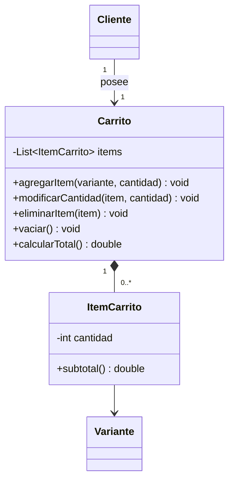

# Spec - Flujo de Carrito

## Objetivo

Implementar el flujo de carrito de RIVA de forma fiel al UML, cubriendo las clases `Carrito` e `ItemCarrito`, su relacion con `Cliente` y `Variante`, y las operaciones principales de gestion de items y calculo de total.

Esta etapa debe dejar `Carrito` completo como pieza de dominio base para que, en una etapa posterior, `TiendaFacade` pueda implementar `confirmarCompra(carrito, metodoPago, cliente)` tal como figura en el UML sin tener que redisenar el carrito.

## Patron identificado

Luego de revisar `docs/RIVA.md`, `docs/USE-CASES.md`, `docs/DETALLE-PATRONES.md` y `docs/class-diagram.mermaid`, el modulo de carrito no aparece modelado como implementacion directa de un patron de diseno.

Decision:

- `Carrito` no implementa `Strategy`, `Observer`, `State` ni `Composite`.
- `Carrito` tampoco aparece marcado con nota de patron en el diagrama de clases.
- Los casos de uso `CU-14`, `CU-15`, `CU-16` y `CU-17` declaran `Patrones aplicados: -`.
- En el UML, `Carrito` es una clase de dominio agregadora que compone `ItemCarrito`.
- `Carrito` si participa como colaborador del patron `Facade`, porque `TiendaFacade` depende de `Carrito` para confirmar la compra, pero la fachada es `TiendaFacade`, no `Carrito`.

Por lo tanto, la implementacion debe priorizar fidelidad al modelo de dominio y a las relaciones UML. No se debe forzar un patron sobre el carrito solo para aumentar la cantidad de patrones visibles.

## Casos de uso cubiertos

- `CU-14`: Agregar Producto al Carrito
- `CU-15`: Modificar Cantidad en Carrito
- `CU-16`: Eliminar Producto del Carrito
- `CU-17`: Vaciar Carrito

## Requerimientos funcionales cubiertos

- `RF-12`: agregar productos al carrito seleccionando talla, color y cantidad.
- `RF-13`: validar stock de la variante al agregar o modificar cantidad.
- `RF-14`: modificar cantidades, eliminar items individuales o vaciar el carrito.
- `RF-15`: recalcular el total dinamicamente ante cualquier cambio.

## Alcance

La feature debe dejar operativo el flujo basico de carrito para clientes autenticados:

- obtener el carrito del cliente
- agregar una variante con cantidad
- si la misma variante ya existe en el carrito, acumular cantidad
- modificar la cantidad de un item existente
- eliminar un item individual
- vaciar el carrito completo
- calcular subtotal por item
- calcular total del carrito
- validar stock disponible contra la `Variante`
- mantener la relacion 1 a 1 entre `Cliente` y `Carrito`
- exponer un carrito consistente y usable por el futuro flujo de `TiendaFacade.confirmarCompra`

## Fuera de alcance

Esta feature no incluye:

- proceso de pago
- creacion de pedidos
- descuento definitivo de stock por compra
- implementacion completa de `TiendaFacade`
- orquestacion de compra completa desde `TiendaFacade.confirmarCompra`
- notificaciones
- historial de pedidos
- promociones, cupones o descuentos
- persistencia de carritos anonimos para usuarios no autenticados
- reserva temporal de stock

## Decision de diseno

### Criterio de cumplimiento del UML

Para esta feature, el codigo debe ser lo mas fiel posible al bloque de carrito del diagrama UML:



Lo obligatorio es:

- que exista una clase de dominio `Carrito`, o equivalente directo si se mantiene el nombre conceptual.
- que exista una clase de dominio `ItemCarrito`.
- que `Carrito` contenga una lista de `ItemCarrito`.
- que `ItemCarrito` referencie una `Variante`.
- que `Cliente` posea un unico carrito activo.
- que las operaciones del UML sean reconocibles en el codigo.

Se permite:

- agregar identificadores tecnicos para persistencia.
- agregar timestamps si la persistencia los necesita.
- agregar metodos auxiliares privados para mantener invariantes.
- usar nombres ingleses en codigo si el resto del backend ya sigue ese criterio, siempre que la equivalencia conceptual sea clara.
- agregar DTOs, repositorios, servicios y controladores necesarios para exponer la funcionalidad.

No se permite:

- reemplazar `Carrito` por una estructura plana sin clase de dominio.
- calcular el total solo en frontend como fuente de verdad.
- permitir items sin variante.
- permitir cantidades negativas o cero dentro del carrito.
- duplicar items para la misma variante dentro del mismo carrito.
- descontar stock al agregar al carrito; el descuento definitivo corresponde al pago exitoso.

### Relacion con patrones

El carrito debe construirse ahora como una pieza completa del dominio, pero con un limite claro: gestiona items y total; no orquesta la compra.

Debe quedar preparado para colaborar con `TiendaFacade` mas adelante:

- `TiendaFacade.confirmarCompra(carrito, metodoPago, cliente)` usara el carrito como entrada.
- `Carrito` debe exponer sus items y total de forma consistente para que luego se pueda construir un `Pedido`.
- `Carrito` debe permitir validar que esta vacio o que contiene items comprables antes de confirmar.
- `Carrito` debe poder vaciarse despues de un pago exitoso, accion que sera invocada por el flujo de compra.
- No hace falta implementar `Facade` en esta feature.

La logica de carrito no debe depender de `MetodoPago`, `Pedido`, `EstadoPedido` ni `CanalNotificacion`.

### Contrato para futura Facade

Al finalizar esta feature, `Carrito` debe ofrecer suficiente comportamiento para que la futura `TiendaFacade` pueda coordinar el caso de uso de compra sin duplicar reglas de carrito.

Contrato esperado para la futura fachada:

- obtener los `ItemCarrito` actuales.
- obtener el total mediante `calcularTotal()`.
- saber si el carrito esta vacio.
- validar que cada item mantiene stock disponible antes de crear el pedido.
- vaciar el carrito cuando el pago termine exitosamente.

La futura `TiendaFacade` sera responsable de:

- recibir `Carrito`, `MetodoPago` y `Cliente`.
- crear el `Pedido` a partir de los items del carrito.
- asociar el `MetodoPago`.
- procesar el pago.
- avanzar estado del pedido.
- disparar notificaciones.
- vaciar el carrito si corresponde.

Esa orquestacion no debe adelantarse dentro de `Carrito`.

## Modelo de dominio esperado

### `Carrito`

Responsabilidades:

- representar el contenedor temporal de compra de un cliente.
- mantener la coleccion de `ItemCarrito`.
- centralizar las reglas de agregado, modificacion, eliminacion y vaciado.
- calcular el total a partir de los subtotales de sus items.

Operaciones esperadas:

- `agregarItem(variante, cantidad)`: agrega una variante nueva o acumula cantidad si ya existe.
- `modificarCantidad(item, cantidad)`: actualiza la cantidad de un item existente.
- `eliminarItem(item)`: remueve un item existente.
- `vaciar()`: elimina todos los items.
- `calcularTotal()`: suma los subtotales de los items.

Invariantes:

- un carrito pertenece a un unico cliente.
- no puede haber dos items con la misma variante en el mismo carrito.
- un carrito vacio tiene total `0`.
- las operaciones que cambian items deben dejar el total recalculable inmediatamente.

### `ItemCarrito`

Responsabilidades:

- representar una linea del carrito.
- mantener la cantidad seleccionada.
- referenciar la `Variante` elegida.
- calcular su subtotal.

Operacion esperada:

- `subtotal()`: devuelve `variante.producto.precio * cantidad`, o el equivalente segun el modelo existente de `Producto` y `Variante`.

Invariantes:

- la cantidad debe ser mayor a cero.
- la variante debe existir.
- el subtotal no debe ser negativo.

### `Cliente`

Responsabilidades relacionadas:

- poseer un unico carrito activo.
- acceder a su carrito para gestionarlo.

Decision:

- si el cliente no tiene carrito al consultar o agregar un item, el backend debe crear uno automaticamente.
- no se debe exponer la posibilidad de operar sobre carritos de otros clientes.

### `Variante`

Responsabilidades relacionadas:

- representar la combinacion de talla y color.
- exponer el stock disponible.
- permitir validar si una cantidad solicitada es posible.

Decision:

- agregar al carrito o modificar cantidad solo valida stock disponible.
- no reserva ni descuenta stock.
- el stock se descuenta definitivamente durante el pago exitoso, segun `RF-18` y `CU-20`.

## Reglas de negocio

### Agregar item

Al agregar una variante:

- la cantidad solicitada debe ser mayor a cero.
- la variante debe existir.
- el producto asociado debe estar activo.
- la variante debe tener stock suficiente para la cantidad final.
- si la variante no existe en el carrito, se crea un `ItemCarrito`.
- si la variante ya existe, se suma la cantidad solicitada al item existente.
- la validacion de stock debe usar la cantidad final acumulada.

Ejemplo:

- stock de variante: `5`
- carrito actual: `2`
- cliente agrega: `3`
- cantidad final: `5`
- resultado: valido

Ejemplo invalido:

- stock de variante: `5`
- carrito actual: `2`
- cliente agrega: `4`
- cantidad final: `6`
- resultado: error de stock insuficiente

### Modificar cantidad

Al modificar la cantidad:

- el item debe pertenecer al carrito del cliente autenticado.
- la nueva cantidad debe ser mayor a cero.
- la variante debe tener stock suficiente para la nueva cantidad.
- si la cantidad indicada es cero desde la UI, el flujo debe derivar a eliminar item, segun `CU-15`.

Decision de backend:

- el endpoint de modificar cantidad debe rechazar `0` como cantidad invalida.
- la UI puede convertir cantidad `0` en accion de eliminar item antes de llamar al backend.

### Eliminar item

Al eliminar:

- el item debe existir.
- el item debe pertenecer al carrito del cliente autenticado.
- el carrito debe recalcular total luego de removerlo.

### Vaciar carrito

Al vaciar:

- se remueven todos los items del carrito del cliente autenticado.
- el total calculado pasa a `0`.
- la operacion debe ser idempotente: vaciar un carrito ya vacio no debe fallar.

### Calcular total

El total:

- debe calcularse en backend como suma de `ItemCarrito.subtotal()`.
- debe devolver `0` si el carrito no tiene items.
- debe usar el precio vigente del producto asociado a la variante.

Decision:

- para carrito se usa precio vigente del producto.
- el congelamiento de precio corresponde a `ItemPedido.precioUnitario` cuando se confirma la compra.

## Contratos backend esperados

Los endpoints pueden ajustarse al estilo existente del backend, pero el contrato conceptual esperado es:

### Obtener carrito actual

`GET /api/cart`

Devuelve el carrito del cliente autenticado.

Respuesta esperada:

- `id`
- `items`
- `total`

Cada item debe incluir:

- `id`
- `variantId`
- `productId`
- `productName`
- `size`
- `color`
- `quantity`
- `unitPrice`
- `subtotal`
- `availableStock`
- `imageUrl` si existe

### Agregar item

`POST /api/cart/items`

Body conceptual:

```json
{
  "variantId": "string",
  "quantity": 1
}
```

Resultado:

- devuelve el carrito actualizado.

Errores esperados:

- variante inexistente.
- producto inactivo.
- cantidad invalida.
- stock insuficiente.

### Modificar cantidad

`PATCH /api/cart/items/{itemId}`

Body conceptual:

```json
{
  "quantity": 2
}
```

Resultado:

- devuelve el carrito actualizado.

Errores esperados:

- item inexistente.
- item no pertenece al cliente.
- cantidad invalida.
- stock insuficiente.

### Eliminar item

`DELETE /api/cart/items/{itemId}`

Resultado:

- devuelve el carrito actualizado o `204 No Content` si el estilo del backend lo prefiere.

Decision recomendada:

- devolver el carrito actualizado para simplificar el frontend y mantener total sincronizado.

### Vaciar carrito

`DELETE /api/cart/items`

Resultado:

- devuelve el carrito vacio o `204 No Content`.

Decision recomendada:

- devolver el carrito vacio con `items: []` y `total: 0`.

## Diseno backend

### Paquetes esperados

Seguir el estilo actual del backend Spring Boot:

- `model.cart` para `Carrito` e `ItemCarrito`.
- `repository` para persistencia.
- `service` para reglas de negocio.
- `controller` para endpoints.
- `dto` para requests y responses.

### Servicio de carrito

El servicio debe resolver:

- obtener o crear carrito para cliente.
- buscar variante.
- validar cantidad.
- validar stock.
- evitar duplicados por variante.
- persistir cambios.
- mapear respuesta con total recalculado.

No debe resolver:

- autenticacion de credenciales.
- procesamiento de pagos.
- creacion definitiva de pedidos.
- descuento de stock.

### Persistencia

Decision recomendada para MongoDB:

- `Carrito` como documento agregado.
- `ItemCarrito` embebido dentro de `Carrito`.
- cada item guarda referencia por id a `Variante` y datos necesarios para reconstruir la respuesta.

Razon:

- el UML marca composicion fuerte entre `Carrito` e `ItemCarrito`.
- los items no tienen ciclo de vida independiente fuera del carrito.
- las operaciones principales modifican el agregado completo.

Si por limitaciones del modelo actual se decide persistir items separados, la composicion conceptual debe seguir siendo visible en dominio y servicio.

## Diseno frontend

### Objetivo

Agregar una experiencia basica de carrito conectada al backend propio.

Pantallas o zonas esperadas:

- boton "Agregar al carrito" desde detalle de producto.
- vista de carrito.
- controles para modificar cantidad.
- accion para eliminar item.
- accion para vaciar carrito.
- visualizacion de total.

### Estados de UI

El frontend debe contemplar:

- carrito cargando.
- carrito vacio.
- error de stock insuficiente.
- error de sesion expirada.
- item eliminado.
- total actualizado.

### Regla de sincronizacion

El total mostrado en frontend debe venir del backend o recalcularse solo como reflejo visual de los datos devueltos. La fuente de verdad del total es `Carrito.calcularTotal()` en backend.

## Testing esperado

### Backend

Tests de dominio o servicio:

- agregar item nuevo.
- agregar misma variante acumula cantidad.
- agregar con cantidad invalida falla.
- agregar superando stock falla.
- modificar cantidad valida actualiza item.
- modificar superando stock falla.
- modificar item ajeno falla.
- eliminar item remueve solo ese item.
- vaciar carrito deja items vacios y total cero.
- calcular total suma subtotales.

Tests de controlador:

- `GET /api/cart` devuelve el carrito del cliente autenticado.
- `POST /api/cart/items` devuelve carrito actualizado.
- `PATCH /api/cart/items/{itemId}` devuelve carrito actualizado.
- `DELETE /api/cart/items/{itemId}` no permite borrar item ajeno.
- `DELETE /api/cart/items` vacia el carrito.

### Frontend

Tests recomendados:

- render de carrito vacio.
- render de items con subtotal y total.
- agregar al carrito desde detalle.
- modificar cantidad dispara actualizacion.
- eliminar item actualiza listado.
- vaciar carrito muestra estado vacio.
- error de stock se muestra al usuario.

## Criterios de aceptacion

La feature se considera terminada cuando:

- el modelo de backend contiene `Carrito` e `ItemCarrito` alineados al UML.
- `Cliente` tiene un unico carrito activo.
- `ItemCarrito` referencia una `Variante`.
- las operaciones `agregarItem`, `modificarCantidad`, `eliminarItem`, `vaciar` y `calcularTotal` existen o son reconocibles.
- no se puede agregar ni modificar un item por encima del stock disponible.
- no se crean items duplicados para la misma variante en el mismo carrito.
- el total se recalcula correctamente despues de cada cambio.
- el frontend puede mostrar, modificar, eliminar y vaciar el carrito consumiendo el backend.
- no se descuenta stock al agregar al carrito.
- el carrito queda listo para ser usado luego por `TiendaFacade.confirmarCompra`.

## Riesgos y decisiones abiertas

### Riesgos

- si `Variante` no expone suficiente informacion de producto/precio, el subtotal puede requerir resolver el producto asociado.
- si la autenticacion de clientes todavia no esta implementada, los endpoints deberan quedar preparados pero pueden requerir un cliente simulado temporal para pruebas.
- si el frontend todavia no tiene flujo de detalle completo con seleccion de variante, agregar al carrito puede depender de cerrar primero esa seleccion.

### Decisiones ya tomadas

- el carrito no implementa un patron propio.
- el carrito colabora con `Facade`, pero `TiendaFacade` es quien representa el patron.
- el backend es fuente de verdad para stock validado y total.
- agregar al carrito no descuenta ni reserva stock.
- `ItemCarrito` usa precio vigente; `ItemPedido` congelara precio al confirmar compra.

## Orden recomendado de ejecucion

1. cerrar modelo de dominio `Carrito` e `ItemCarrito`.
2. implementar reglas de negocio en servicio backend.
3. exponer endpoints de carrito.
4. conectar frontend desde detalle de producto.
5. construir vista de carrito.
6. agregar tests de reglas de negocio y contratos HTTP.
