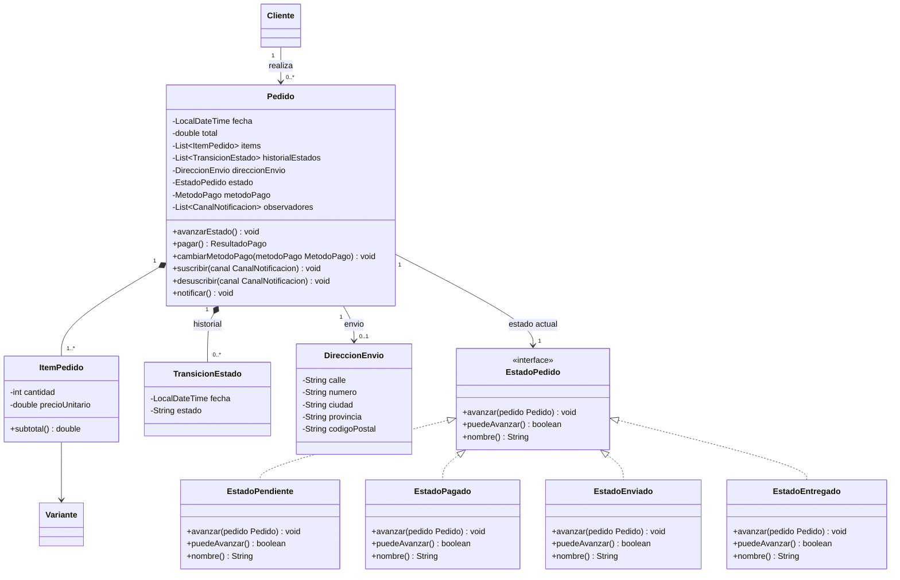

# Spec - Pedidos con Patron State

## Objetivo

Implementar el modulo de pedidos de RIVA en backend respetando de forma estricta el bloque de `Pedido` y `State` definido en el UML del proyecto.

La prioridad de esta feature es que el codigo pueda compararse directamente contra `docs/class-diagram.mermaid` y que las clases, atributos, metodos, responsabilidades y relaciones principales sean reconocibles sin reinterpretaciones. El patron `State` debe quedar implementado de forma canonica: `Pedido` funciona como contexto, `EstadoPedido` como interfaz de estado y cada estado concreto encapsula su propia transicion.

La parte de frontend no necesita cumplir patrones de diseno. Su rol, si se implementa en esta etapa, es solo consumir los endpoints de pedidos y mostrar informacion al usuario.

## Patron identificado

El patron principal de esta feature es `State`.

Segun el UML:

- `Pedido` es el contexto del patron.
- `EstadoPedido` es la interfaz comun de estado.
- `EstadoPendiente`, `EstadoPagado`, `EstadoEnviado` y `EstadoEntregado` son estados concretos.
- `Pedido.avanzarEstado()` no decide la transicion con condicionales propios: delega en `estado.avanzar(this)`.
- Cada estado concreto sabe cual es el siguiente estado valido.
- `EstadoEntregado` es el estado final: `puedeAvanzar()` devuelve `false`.
- Cada cambio de estado se registra en `historialEstados` mediante `TransicionEstado`.

Esta feature tambien prepara a `Pedido` para colaborar mas adelante con `Strategy`, `Observer` y `Facade`, porque el UML muestra que `Pedido` tiene `metodoPago`, `observadores`, `pagar()`, `cambiarMetodoPago()`, `suscribir()`, `desuscribir()` y `notificar()`. Sin embargo, la implementacion completa de esos patrones queda fuera de esta tarea salvo contratos minimos necesarios para respetar firmas y relaciones.

## Casos de uso cubiertos

- `CU-18`: Confirmar Compra, solo en la parte de crear un pedido con estado inicial `Pendiente`.
- `CU-21`: Consultar Historial de Pedidos.
- `CU-22`: Consultar Detalle de Pedido.
- `CU-23`: Avanzar Estado de Pedido, solo en la parte del patron `State`.

## Requerimientos funcionales cubiertos

- `RF-20`: al confirmar la compra, se genera un pedido con estado inicial `Pendiente` asociado al cliente.
- `RF-21`: el ciclo de estados del pedido es `Pendiente -> Pagado -> Enviado -> Entregado`, con transiciones controladas por el estado actual.
- `RF-22`: solo el administrador puede avanzar el estado hacia `Enviado` o `Entregado`. Mientras no exista autenticacion real, el backend debe dejar este punto preparado y documentado con control temporal coherente con el resto del proyecto.
- `RF-23`: el cliente puede consultar el historial y detalle de sus pedidos.

## Alcance

La feature debe dejar operativo el dominio de pedidos y el patron `State` en backend:

- crear `Pedido` desde un `Carrito` existente.
- convertir cada `ItemCarrito` en `ItemPedido`.
- congelar `precioUnitario` en `ItemPedido` al momento de crear el pedido.
- calcular y persistir `total` del pedido.
- iniciar todo pedido en `EstadoPendiente`.
- registrar la transicion inicial en `historialEstados`.
- avanzar estados usando `Pedido.avanzarEstado()`.
- delegar la transicion real a `EstadoPedido.avanzar(pedido)`.
- registrar cada nuevo estado en `historialEstados`.
- impedir avanzar un pedido en `EstadoEntregado`.
- consultar pedidos por cliente.
- consultar el detalle de un pedido.
- exponer endpoints basicos para crear, listar, ver detalle y avanzar estado.
- cubrir con tests que el patron `State` existe y no fue reemplazado por un enum con `switch`.

## Fuera de alcance

Esta feature no incluye:

- implementacion completa de `Strategy` de pagos.
- procesamiento real o simulado de pagos.
- implementacion completa de `Observer` de notificaciones.
- envio de email, SMS o push.
- implementacion completa de `TiendaFacade`.
- descuento definitivo de stock por pago exitoso.
- JWT real o roles reales si todavia no estan implementados.
- panel administrativo completo en frontend.
- preferencias de notificacion.
- cancelacion de pedidos.
- devoluciones, reembolsos o estados extra no modelados en el UML.

## Decision de diseno

### Criterio de cumplimiento del UML

Para esta feature el backend debe ser lo mas fiel posible al UML.

Lo obligatorio es:

- usar los nombres conceptuales del UML para las clases de dominio del bloque de pedidos.
- implementar una clase `Pedido`.
- implementar una clase `ItemPedido`.
- implementar una clase `TransicionEstado`.
- implementar una clase `DireccionEnvio`.
- implementar una interfaz `EstadoPedido`.
- implementar las clases `EstadoPendiente`, `EstadoPagado`, `EstadoEnviado` y `EstadoEntregado`.
- incluir en `Pedido` los atributos del UML, aunque algunos queden temporalmente sin uso completo.
- incluir en `Pedido` los metodos del UML, aunque algunos relacionados con pagos y notificaciones tengan implementacion minima temporal.
- mantener la relacion `Pedido "1" *-- "1..*" ItemPedido`.
- mantener la relacion `Pedido "1" *-- "0..*" TransicionEstado`.
- mantener la relacion `Pedido "1" --> "0..1" DireccionEnvio`.
- mantener la relacion `Pedido "1" --> "1" EstadoPedido`.
- mantener la relacion conceptual `ItemPedido --> Variante`.

Se permite:

- agregar `id`, `clienteId`, timestamps tecnicos y anotaciones de MongoDB.
- agregar constructores, getters, setters restringidos y metodos auxiliares privados necesarios para persistencia.
- agregar DTOs, repositorios, servicios y controladores.
- agregar adaptadores tecnicos para serializar/deserializar el estado si MongoDB no persiste polimorfismo de forma directa.
- usar ids tecnicos para referenciar `Cliente` y `Variante` mientras las clases completas de usuario no existan.

No se permite:

- reemplazar `EstadoPedido` por un enum como unica representacion del estado.
- implementar las transiciones con un `switch` o cadena de `if` dentro de `Pedido.avanzarEstado()`.
- hacer que `Pedido` conozca directamente todos los caminos de transicion.
- omitir las clases concretas de estado.
- omitir `historialEstados`.
- permitir estados fuera del ciclo definido por el UML.
- agregar estados no modelados, como `Cancelado`, `Rechazado` o `Preparando`, en esta etapa.
- recalcular el precio historico desde `Producto` cuando se consulta un pedido: `ItemPedido.precioUnitario` debe preservar el precio al confirmar.

### Idioma y nombres

En este modulo se debe priorizar fidelidad al UML por encima de la convencion previa de nombres en ingles.

Decision:

- Las clases del bloque de pedidos deben llamarse como el UML: `Pedido`, `ItemPedido`, `TransicionEstado`, `DireccionEnvio`, `EstadoPedido`, `EstadoPendiente`, `EstadoPagado`, `EstadoEnviado`, `EstadoEntregado`.
- Los metodos del patron deben llamarse como el UML: `avanzarEstado`, `avanzar`, `puedeAvanzar`, `nombre`.
- Los metodos de `Pedido` relacionados a otros patrones deben existir con los nombres del UML: `pagar`, `cambiarMetodoPago`, `suscribir`, `desuscribir`, `notificar`.
- Los atributos de dominio deben conservar nombres conceptuales del UML: `fecha`, `total`, `items`, `historialEstados`, `direccionEnvio`, `estado`, `metodoPago`, `observadores`.

Si se agregan clases tecnicas, pueden seguir la convencion actual del backend, por ejemplo `PedidoService`, `PedidoController`, `PedidoRepository`, `PedidoResponse` y `CreatePedidoRequest`.

## Modelo UML objetivo

La implementacion debe reflejar este fragmento del diagrama:



## Diseno backend

### Paquetes esperados

Usar paquetes claros y cercanos al dominio:

- `com.riva.model.pedido` para `Pedido`, `ItemPedido`, `TransicionEstado` y `DireccionEnvio`.
- `com.riva.pattern.state` o `com.riva.model.pedido.state` para `EstadoPedido` y estados concretos.
- `com.riva.repository` para `PedidoRepository`.
- `com.riva.service` para `PedidoService`.
- `com.riva.controller` para `PedidoController`.
- `com.riva.dto` para requests y responses.

Decision recomendada:

- Si el proyecto ya ubico `CatalogComponent` bajo `pattern.composite`, usar `com.riva.pattern.state` para hacer visible el patron en la defensa.
- Las entidades de dominio `Pedido` e `ItemPedido` deben quedar en `model.pedido`, no dentro del paquete `pattern`, porque son parte del dominio.

### `Pedido`

Responsabilidades:

- representar una compra confirmada por un cliente.
- funcionar como contexto del patron `State`.
- mantener los items comprados.
- mantener el total historico del pedido.
- mantener direccion de envio, si corresponde.
- mantener el estado actual como `EstadoPedido`.
- delegar la transicion a `estado.avanzar(this)`.
- registrar cada estado alcanzado en `historialEstados`.
- preparar puntos de integracion con pago y notificaciones.

Atributos obligatorios segun UML:

- `LocalDateTime fecha`
- `double total`
- `List<ItemPedido> items`
- `List<TransicionEstado> historialEstados`
- `DireccionEnvio direccionEnvio`
- `EstadoPedido estado`
- `MetodoPago metodoPago`
- `List<CanalNotificacion> observadores`

Atributos tecnicos permitidos:

- `String id`
- `String clienteId`
- `String estadoNombre`, solo si se necesita para persistir y reconstruir `estado`
- `LocalDateTime updatedAt`, si el estilo del proyecto lo justifica

Metodos obligatorios segun UML:

- `void avanzarEstado()`
- `ResultadoPago pagar()`
- `void cambiarMetodoPago(MetodoPago metodoPago)`
- `void suscribir(CanalNotificacion canal)`
- `void desuscribir(CanalNotificacion canal)`
- `void notificar()`

Metodos auxiliares permitidos:

- `void setEstado(EstadoPedido estado)`, con visibilidad lo mas restringida posible pero usable por los estados concretos.
- `void registrarEstadoActual()`
- `String nombreEstadoActual()`
- `boolean puedeAvanzarEstado()`
- `void validarTieneItems()`

Regla clave:

- `avanzarEstado()` debe tener una estructura equivalente a:

```java
public void avanzarEstado() {
    estado.avanzar(this);
    registrarEstadoActual();
}
```

No debe contener un `switch` por estado ni una cadena de `if/else` para decidir el siguiente estado.

### `EstadoPedido`

Debe ser una interfaz con exactamente las operaciones conceptuales del UML:

- `void avanzar(Pedido pedido)`
- `boolean puedeAvanzar()`
- `String nombre()`

Responsabilidades:

- definir el contrato comun de todos los estados.
- permitir que `Pedido` delegue el comportamiento variable.
- expresar si un estado puede avanzar sin que `Pedido` conozca reglas concretas.

### `EstadoPendiente`

Responsabilidades:

- representar el estado inicial de todo pedido.
- avanzar el pedido a `EstadoPagado`.

Comportamiento esperado:

- `nombre()` devuelve `"Pendiente"`.
- `puedeAvanzar()` devuelve `true`.
- `avanzar(pedido)` ejecuta `pedido.setEstado(new EstadoPagado())`.

### `EstadoPagado`

Responsabilidades:

- representar un pedido con pago confirmado.
- avanzar el pedido a `EstadoEnviado`.

Comportamiento esperado:

- `nombre()` devuelve `"Pagado"`.
- `puedeAvanzar()` devuelve `true`.
- `avanzar(pedido)` ejecuta `pedido.setEstado(new EstadoEnviado())`.

### `EstadoEnviado`

Responsabilidades:

- representar un pedido despachado.
- avanzar el pedido a `EstadoEntregado`.

Comportamiento esperado:

- `nombre()` devuelve `"Enviado"`.
- `puedeAvanzar()` devuelve `true`.
- `avanzar(pedido)` ejecuta `pedido.setEstado(new EstadoEntregado())`.

### `EstadoEntregado`

Responsabilidades:

- representar el estado final del ciclo de vida.
- impedir nuevas transiciones.

Comportamiento esperado:

- `nombre()` devuelve `"Entregado"`.
- `puedeAvanzar()` devuelve `false`.
- `avanzar(pedido)` no cambia el estado.

Decision de error:

- Para que el comportamiento sea claro a nivel API, si se intenta avanzar desde `EstadoEntregado`, el servicio debe devolver error de validacion o conflicto.
- La clase `EstadoEntregado.avanzar(pedido)` debe lanzar una excepcion controlada para que el endpoint responda un error explicito.

### `ItemPedido`

Responsabilidades:

- representar una linea historica del pedido.
- guardar la cantidad comprada.
- guardar el precio unitario congelado al momento de confirmar la compra.
- referenciar la variante comprada.
- calcular su subtotal historico.

Atributos obligatorios segun UML:

- `int cantidad`
- `double precioUnitario`

Atributos tecnicos permitidos para preservar detalle:

- `String id`
- `String varianteId`
- `String productoId`
- `String productoNombre`
- `String talla`
- `String color`

Metodos obligatorios:

- `double subtotal()`

Reglas:

- `cantidad` debe ser mayor a cero.
- `precioUnitario` no puede ser negativo.
- `subtotal()` devuelve `cantidad * precioUnitario`.
- El subtotal no debe consultar el precio actual del producto.

### `TransicionEstado`

Responsabilidades:

- registrar cada estado alcanzado por un pedido.
- preservar fecha y nombre del estado.

Atributos obligatorios segun UML:

- `LocalDateTime fecha`
- `String estado`

Reglas:

- al crear un pedido debe registrarse una transicion inicial con estado `"Pendiente"`.
- despues de cada avance exitoso debe agregarse una nueva transicion con el nombre del nuevo estado.
- el historial debe mantener orden cronologico.

### `DireccionEnvio`

Responsabilidades:

- representar la direccion asociada al pedido.

Atributos obligatorios segun UML:

- `String calle`
- `String numero`
- `String ciudad`
- `String provincia`
- `String codigoPostal`

Reglas:

- puede ser opcional en la primera version si el flujo de checkout aun no captura direccion.
- si el endpoint recibe direccion, debe mapearse a esta clase y persistirse dentro de `Pedido`.

### Contratos minimos para Strategy y Observer

Como `Pedido` en el UML contiene metodos y atributos de pago y notificaciones, la feature debe decidir entre dos opciones.

Decision recomendada:

- crear contratos minimos `MetodoPago`, `ResultadoPago` y `CanalNotificacion` si aun no existen, solo para que `Pedido` compile con las firmas del UML.
- no implementar todavia `PagoTarjeta`, `PagoPayPal`, `PagoTransferencia`, `CanalEmail`, `CanalSMS` ni `CanalPush`.

Contrato minimo:

- `MetodoPago` debe exponer `procesarPago(double monto)` y `validarDatosPago()` segun UML, aunque las implementaciones concretas se agreguen despues.
- `ResultadoPago` debe existir como objeto simple con `boolean exito` y `String mensaje`.
- `CanalNotificacion` debe exponer `actualizar(Pedido pedido)` segun UML.

Implementacion temporal en `Pedido`:

- `cambiarMetodoPago(metodoPago)` asigna el atributo.
- `pagar()` puede lanzar excepcion si `metodoPago` es `null`, o delegar en `metodoPago.procesarPago(total)` si se entrega una implementacion de prueba.
- `suscribir(canal)` agrega el canal a `observadores`.
- `desuscribir(canal)` lo remueve.
- `notificar()` recorre `observadores` y llama `actualizar(this)`.

Importante:

- Estas piezas no convierten esta feature en Strategy u Observer completos.
- Su objetivo es mantener el shape del UML de `Pedido`.
- La implementacion completa de pagos y notificaciones debe tener specs separadas.

## Persistencia

### MongoDB

`Pedido` debe persistirse como documento agregado.

Decision recomendada:

- `Pedido` como documento principal en coleccion `pedidos`.
- `ItemPedido` embebido dentro de `Pedido`.
- `TransicionEstado` embebido dentro de `Pedido`.
- `DireccionEnvio` embebida dentro de `Pedido`.

Razon:

- El UML marca composicion fuerte entre `Pedido` e `ItemPedido`.
- El UML marca composicion fuerte entre `Pedido` e `TransicionEstado`.
- Los items y transiciones no tienen ciclo de vida independiente fuera del pedido.

### Persistencia del estado

MongoDB no debe obligar a perder el patron.

Decision recomendada:

- Persistir un campo tecnico `estadoNombre` con valores `"Pendiente"`, `"Pagado"`, `"Enviado"` o `"Entregado"`.
- Reconstruir el objeto `EstadoPedido` correspondiente al cargar o antes de operar sobre el pedido.
- Mantener `estado` como atributo de dominio de tipo `EstadoPedido`.

No se permite:

- usar solo `estadoNombre` o un enum y eliminar `EstadoPedido`.
- poner la logica de transicion en el servicio por comodidad de persistencia.

## Flujo de creacion de pedido

### Entrada

La creacion de pedido parte del carrito actual del cliente.

Mientras no exista autenticacion real, se puede seguir el criterio actual del carrito:

- usar `X-Cliente-Id` con default temporal.
- dejar comentario tecnico indicando que debe reemplazarse por el usuario autenticado cuando se implemente JWT.

### Pasos esperados

1. `PedidoService` obtiene el `Carrito` del cliente.
2. Valida que el carrito no este vacio.
3. Valida que cada item siga teniendo stock suficiente.
4. Crea un `Pedido`.
5. Copia cada `ItemCarrito` a un `ItemPedido`.
6. Congela `precioUnitario` con el precio vigente al momento de crear el pedido.
7. Calcula `total` como suma de `ItemPedido.subtotal()`.
8. Asigna `fecha` con `LocalDateTime.now()`.
9. Asigna `estado` con `new EstadoPendiente()`.
10. Registra `TransicionEstado(fechaActual, "Pendiente")`.
11. Persiste el pedido.

Decision:

- Crear pedido no debe vaciar el carrito todavia.
- Vaciar carrito corresponde al flujo de pago exitoso o a `TiendaFacade.confirmarCompra`, que queda fuera de esta feature.
- Crear pedido no debe descontar stock.
- Descontar stock corresponde a `CU-20` ante pago exitoso.

## Flujo de avance de estado

### Pasos esperados

1. `PedidoService` busca el pedido.
2. Verifica que existe.
3. Reconstruye el objeto `EstadoPedido` desde el estado persistido, si corresponde.
4. Verifica `pedido.puedeAvanzarEstado()` o delega en `estado.puedeAvanzar()`.
5. Llama a `pedido.avanzarEstado()`.
6. `Pedido` llama a `estado.avanzar(this)`.
7. El estado concreto invoca `pedido.setEstado(siguienteEstado)`.
8. `Pedido` registra una nueva `TransicionEstado` con el nombre del estado nuevo.
9. El servicio persiste el pedido actualizado.
10. El endpoint devuelve el pedido actualizado.

### Transiciones validas

- `EstadoPendiente` -> `EstadoPagado`
- `EstadoPagado` -> `EstadoEnviado`
- `EstadoEnviado` -> `EstadoEntregado`

### Transiciones invalidas

- `EstadoEntregado` -> cualquier estado.
- Saltos como `Pendiente` -> `Enviado`.
- Retrocesos como `Enviado` -> `Pagado`.
- Cambios manuales de estado desde controller o service sin pasar por `Pedido.avanzarEstado()`.

## Endpoints backend esperados

Los endpoints pueden ajustarse al estilo actual, pero deben cubrir estos contratos conceptuales.

### Crear pedido desde carrito

`POST /api/orders`

Headers temporales:

- `X-Cliente-Id`

Body opcional:

```json
{
  "direccionEnvio": {
    "calle": "Av. Corrientes",
    "numero": "1234",
    "ciudad": "CABA",
    "provincia": "Buenos Aires",
    "codigoPostal": "C1043"
  }
}
```

Respuesta:

- pedido creado.
- estado actual `"Pendiente"`.
- historial con una transicion inicial.
- items copiados desde el carrito.
- total congelado.

Errores:

- carrito vacio.
- item sin variante valida.
- stock insuficiente.
- producto inactivo.

### Listar pedidos del cliente

`GET /api/orders`

Headers temporales:

- `X-Cliente-Id`

Respuesta:

- lista de pedidos del cliente.
- orden descendente por `fecha`.
- incluye id, fecha, total, estado actual y cantidad de items.

### Consultar detalle de pedido

`GET /api/orders/{id}`

Headers temporales:

- `X-Cliente-Id`

Respuesta:

- pedido completo.
- items.
- direccion.
- estado actual.
- historial de estados.

Errores:

- pedido inexistente.
- pedido no pertenece al cliente.

### Avanzar estado de pedido

`POST /api/orders/{id}/advance`

Uso conceptual:

- endpoint administrativo.

Mientras no exista autenticacion:

- puede permitirse temporalmente sin rol real.
- debe quedar comentado como restriccion de autenticacion pendiente para rol `Administrador` cuando se implemente `CU-03 + JWT`.

Respuesta:

- pedido actualizado.
- estado actual nuevo.
- historial con una transicion adicional.

Errores:

- pedido inexistente.
- pedido en estado final.
- estado persistido invalido.

## DTOs esperados

### `CreatePedidoRequest`

Campos:

- `DireccionEnvioRequest direccionEnvio`

Decision:

- `direccionEnvio` puede ser opcional.
- Si no se recibe, `Pedido.direccionEnvio` queda `null`.

### `PedidoResponse`

Campos recomendados:

- `id`
- `clienteId`
- `fecha`
- `total`
- `estado`
- `items`
- `historialEstados`
- `direccionEnvio`

### `ItemPedidoResponse`

Campos recomendados:

- `id`
- `varianteId`
- `productoId`
- `productoNombre`
- `talla`
- `color`
- `cantidad`
- `precioUnitario`
- `subtotal`

### `TransicionEstadoResponse`

Campos:

- `fecha`
- `estado`

## Reglas de negocio

### Estado inicial

- Todo `Pedido` nuevo inicia en `EstadoPendiente`.
- No se puede crear un pedido directamente en `Pagado`, `Enviado` o `Entregado`.
- La transicion inicial debe quedar en `historialEstados`.

### Historial

- El historial debe registrar nombres de estado, no nombres de clases Java.
- Los valores deben ser exactamente: `"Pendiente"`, `"Pagado"`, `"Enviado"`, `"Entregado"`.
- No debe registrarse una transicion si el avance falla.
- No debe registrarse dos veces el mismo avance por una misma llamada.

### Total

- `Pedido.total` se calcula al crear el pedido.
- `ItemPedido.precioUnitario` congela el precio.
- Cambios posteriores en `Product.precio` no modifican pedidos ya creados.
- `Pedido.total` debe coincidir con la suma de `ItemPedido.subtotal()`.

### Items

- Un pedido no puede existir sin items.
- Cada `ItemPedido` debe tener cantidad mayor a cero.
- Cada `ItemPedido` debe conservar la variante comprada o al menos su `varianteId`.
- Los datos visibles del item deben permitir consultar el pedido aunque luego cambie el producto.

### Stock

- Crear pedido valida stock disponible.
- Crear pedido no descuenta stock.
- Avanzar de `Pendiente` a `Pagado` en esta feature no debe descontar stock si no se implementa pago.
- El descuento de stock queda para `CU-20` / Strategy / Facade.

### Seguridad temporal

- Los endpoints de cliente deben recibir `X-Cliente-Id` hasta que exista JWT.
- No se debe permitir que un cliente consulte pedidos de otro cliente.
- El endpoint administrativo de avance debe dejar una nota tecnica de autenticacion pendiente si no hay roles reales.

## Relacion con otros patrones

### Strategy

`Pedido` tiene `metodoPago`, `pagar()` y `cambiarMetodoPago()` porque el UML lo exige.

En esta feature:

- se puede crear la interfaz `MetodoPago`.
- se puede crear `ResultadoPago`.
- `pagar()` puede delegar si existe `metodoPago`.
- no se implementan estrategias concretas.

### Observer

`Pedido` tiene `observadores`, `suscribir()`, `desuscribir()` y `notificar()` porque el UML lo exige.

En esta feature:

- se puede crear la interfaz `CanalNotificacion`.
- `notificar()` puede recorrer la lista de observadores.
- no se implementan canales concretos.
- no se dispara automaticamente una notificacion desde el servicio salvo que ya existan observadores configurados.

### Facade

`TiendaFacade` queda fuera de alcance.

Esta feature debe dejar listo lo necesario para que luego `TiendaFacade.confirmarCompra(carrito, metodoPago, cliente)` pueda:

- crear un `Pedido`.
- asociar `MetodoPago`.
- llamar `pagar()`.
- avanzar estado.
- notificar.
- vaciar carrito si el pago fue exitoso.

## Diseno frontend

El frontend no tiene que implementar ningun patron.

Si se decide tocar frontend en esta etapa, el alcance recomendado es minimo:

- boton o accion desde carrito para crear pedido.
- vista simple de historial de pedidos.
- vista simple de detalle de pedido.
- accion administrativa temporal para avanzar estado, si ayuda a la demo.

No es obligatorio para validar el patron.

## Testing esperado

### Tests de dominio `Pedido`

- crear pedido inicia en `EstadoPendiente`.
- crear pedido registra historial inicial `"Pendiente"`.
- `Pedido.avanzarEstado()` desde `EstadoPendiente` cambia a `"Pagado"`.
- avanzar desde `EstadoPagado` cambia a `"Enviado"`.
- avanzar desde `EstadoEnviado` cambia a `"Entregado"`.
- avanzar desde `EstadoEntregado` falla con excepcion controlada y no cambia estado.
- cada avance exitoso agrega una `TransicionEstado`.
- `Pedido.avanzarEstado()` delega en `EstadoPedido`, verificable por estructura o por test de estados concretos.

### Tests de estados concretos

- `EstadoPendiente.nombre()` devuelve `"Pendiente"`.
- `EstadoPendiente.puedeAvanzar()` devuelve `true`.
- `EstadoPendiente.avanzar(pedido)` asigna `EstadoPagado`.
- `EstadoPagado.avanzar(pedido)` asigna `EstadoEnviado`.
- `EstadoEnviado.avanzar(pedido)` asigna `EstadoEntregado`.
- `EstadoEntregado.puedeAvanzar()` devuelve `false`.
- `EstadoEntregado.avanzar(pedido)` no permite una transicion valida.

### Tests de `ItemPedido`

- `subtotal()` devuelve `cantidad * precioUnitario`.
- cantidad cero o negativa es invalida.
- precio unitario negativo es invalido.

### Tests de servicio

- crear pedido desde carrito con items validos persiste pedido.
- crear pedido desde carrito vacio falla.
- crear pedido con stock insuficiente falla.
- crear pedido congela precio unitario.
- listar pedidos devuelve solo pedidos del cliente.
- consultar detalle de pedido ajeno falla.
- avanzar pedido persiste nuevo estado e historial.
- avanzar pedido entregado devuelve error.

### Tests de controller

- `POST /api/orders` devuelve pedido en `"Pendiente"`.
- `GET /api/orders` devuelve pedidos del cliente.
- `GET /api/orders/{id}` devuelve detalle.
- `POST /api/orders/{id}/advance` devuelve pedido con estado siguiente.
- errores de dominio se mapean a respuestas HTTP consistentes.

## Criterios de aceptacion

La feature se considera terminada cuando:

- existen las clases `Pedido`, `ItemPedido`, `TransicionEstado` y `DireccionEnvio`.
- existe la interfaz `EstadoPedido`.
- existen las clases `EstadoPendiente`, `EstadoPagado`, `EstadoEnviado` y `EstadoEntregado`.
- `Pedido` contiene los atributos del UML o equivalentes directos documentados.
- `Pedido` contiene los metodos del UML.
- `Pedido.avanzarEstado()` delega en `EstadoPedido.avanzar(pedido)`.
- no hay `switch` ni cadena de `if/else` en `Pedido` para resolver transiciones.
- la cadena de estados es `Pendiente -> Pagado -> Enviado -> Entregado`.
- `EstadoEntregado` es final.
- cada avance exitoso registra `TransicionEstado`.
- `ItemPedido` congela `precioUnitario`.
- el total del pedido se calcula desde los subtotales.
- se puede crear un pedido desde un carrito.
- se puede listar y consultar pedidos.
- se puede avanzar el estado de un pedido.
- hay tests que prueban el patron `State` y las reglas principales.

## Riesgos y decisiones abiertas

### Riesgos

- MongoDB puede requerir un mecanismo explicito para reconstruir `EstadoPedido` desde un string persistido.
- Si se implementa el avance de `Pendiente` a `Pagado` antes de Strategy, puede parecer que el pago fue exitoso sin haber procesado pago. Debe documentarse como avance administrativo/demo temporal o limitarse segun el flujo que se elija.
- Si no existe `Cliente` como entidad real, se debe usar `clienteId` temporal sin bloquear el modulo.
- Si se intenta implementar Strategy, Observer y Facade completos en esta misma tarea, el alcance se vuelve demasiado grande.

### Decisiones ya tomadas

- El backend debe priorizar fidelidad al UML.
- El frontend no necesita cumplir patrones.
- El carrito no es la Facade; solo colabora con la futura `TiendaFacade`.
- Esta feature implementa `State` completo.
- Strategy y Observer quedan como contratos minimos o fuera de alcance.
- No se agregan estados no modelados.
- Crear pedido no vacia carrito.
- Crear pedido no descuenta stock.

## Orden recomendado de ejecucion

1. Crear clases de dominio `Pedido`, `ItemPedido`, `TransicionEstado` y `DireccionEnvio`.
2. Crear interfaz `EstadoPedido`.
3. Crear `EstadoPendiente`, `EstadoPagado`, `EstadoEnviado` y `EstadoEntregado`.
4. Implementar `Pedido.avanzarEstado()` y registro de historial.
5. Agregar contratos minimos `MetodoPago`, `ResultadoPago` y `CanalNotificacion` si hacen falta para respetar firmas.
6. Implementar persistencia de `Pedido`.
7. Implementar `PedidoService` para crear desde carrito, listar, consultar y avanzar.
8. Implementar `PedidoController`.
9. Agregar tests de dominio del patron.
10. Agregar tests de servicio y controller.
11. Opcional: conectar una vista simple de frontend para demo.
