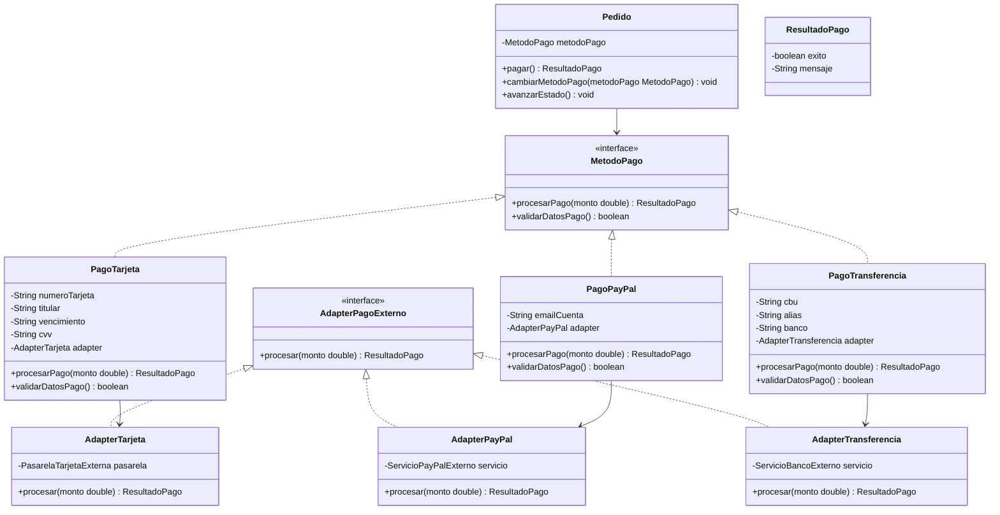

# Spec - Pagos con Patron Strategy

## Objetivo

Implementar el flujo de seleccion y procesamiento de pago de RIVA respetando de forma estricta el bloque de `Pago (Strategy)` y `Pasarelas de Pago (Adapter)` definido en `docs/class-diagram.mermaid`.

La prioridad de esta feature es que el codigo pueda compararse directamente contra el UML: al leer el diagrama debe ser evidente que `Pedido` delega el algoritmo de pago en `MetodoPago`, que existen estrategias concretas para tarjeta, PayPal y transferencia, y que esas estrategias usan adapters simulados para representar la comunicacion con sistemas externos.

Los medios de pago no se integran con proveedores reales. Toda respuesta de pago se simula dentro del backend, pero manteniendo la estructura del patron para que el diseno sea defendible.

## Patron identificado

El patron principal de esta feature es `Strategy`.

Segun el UML:

- `MetodoPago` es la interfaz strategy.
- `PagoTarjeta`, `PagoPayPal` y `PagoTransferencia` son estrategias concretas.
- `Pedido` tiene un atributo `metodoPago`.
- `Pedido.cambiarMetodoPago(metodoPago)` cambia la estrategia en tiempo de ejecucion.
- `Pedido.pagar()` delega en `metodoPago.validarDatosPago()` y `metodoPago.procesarPago(total)`.
- `ResultadoPago` representa el resultado comun de cualquier estrategia.

Esta feature tambien implementa el bloque `Adapter` asociado al pago, porque el UML muestra que cada estrategia concreta no habla directo con el proveedor externo, sino mediante un adapter:

- `AdapterPagoExterno` es la interfaz comun de adaptacion.
- `AdapterTarjeta`, `AdapterPayPal` y `AdapterTransferencia` implementan esa interfaz.
- `PasarelaTarjetaExterna`, `ServicioPayPalExterno` y `ServicioBancoExterno` simulan los proveedores externos.
- Cada adapter traduce la respuesta simulada del proveedor a `ResultadoPago`.

## Casos de uso cubiertos

- `CU-19`: Seleccionar Metodo de Pago.
- `CU-20`: Procesar Pago.
- `CU-22`: Consultar Detalle de Pedido, en la parte de mostrar el metodo de pago utilizado.

## Requerimientos funcionales cubiertos

- `RF-16`: ofrecer tarjeta, PayPal y transferencia bancaria.
- `RF-17`: permitir seleccionar el metodo de pago en tiempo de ejecucion usando `Strategy`.
- `RF-18`: ante pago exitoso, reducir stock de variantes adquiridas y transicionar el pedido a `"Pagado"`.
- `RF-19`: ante fallo de pago, mantener el pedido en `"Pendiente"` sin descontar stock y permitir reintento.

## Alcance

La feature debe dejar operativo el pago simulado en backend:

- crear estrategias concretas `PagoTarjeta`, `PagoPayPal` y `PagoTransferencia`.
- crear adapters simulados `AdapterTarjeta`, `AdapterPayPal` y `AdapterTransferencia`.
- crear proveedores externos simulados para tarjeta, PayPal y banco.
- crear DTO `ProcesarPagoRequest`.
- crear DTO `ProcesarPagoResponse`.
- agregar endpoint `POST /api/orders/{id}/payment`.
- validar que el pedido exista, pertenezca al cliente y este en estado `"Pendiente"`.
- instanciar la estrategia concreta segun el metodo recibido.
- asignar la estrategia con `pedido.cambiarMetodoPago(metodoPago)`.
- ejecutar `pedido.pagar()`.
- si el pago falla, persistir el pedido sin cambios de estado, sin descuento de stock y sin vaciar carrito.
- si el pago es exitoso, validar stock vigente, descontar stock, avanzar el pedido a `"Pagado"` usando `State`, guardar productos, guardar pedido y vaciar carrito.
- devolver resultado de pago y pedido actualizado.
- actualizar frontend para que el usuario seleccione metodo y complete un formulario simulado por metodo.

## Fuera de alcance

Esta feature no incluye:

- integracion con medios de pago reales.
- autenticacion real con JWT.
- roles reales de cliente y administrador.
- implementacion completa de `Observer`.
- envio real o simulado de email, SMS o push.
- implementacion completa de `TiendaFacade`.
- refund, contracargo, cancelacion o reversion de pagos.
- estados nuevos como `"Rechazado"` o `"Cancelado"`.
- almacenamiento de datos sensibles reales de tarjeta.

## Decision de diseno

### Criterio de cumplimiento del UML

El backend debe priorizar fidelidad al UML por encima de atajos tecnicos.

Lo obligatorio es:

- mantener `MetodoPago` como interfaz con `procesarPago(double monto)` y `validarDatosPago()`.
- implementar `PagoTarjeta`, `PagoPayPal` y `PagoTransferencia`.
- mantener `Pedido.cambiarMetodoPago(MetodoPago metodoPago)`.
- mantener `Pedido.pagar()` como metodo que delega en la estrategia seleccionada.
- crear `AdapterPagoExterno` con `procesar(double monto)`.
- implementar `AdapterTarjeta`, `AdapterPayPal` y `AdapterTransferencia`.
- modelar proveedores externos simulados con clases reconocibles: `PasarelaTarjetaExterna`, `ServicioPayPalExterno`, `ServicioBancoExterno`.
- devolver siempre un `ResultadoPago`.
- usar `Pedido.avanzarEstado()` para pasar de `"Pendiente"` a `"Pagado"`, sin cambiar el estado manualmente desde el service.

No se permite:

- reemplazar Strategy por un `switch` que procese todo dentro de `PedidoService`.
- hacer que `Pedido.pagar()` conozca tarjeta, PayPal o transferencia.
- avanzar el pedido a `"Pagado"` si `ResultadoPago.exito()` es `false`.
- descontar stock antes de confirmar que el pago fue exitoso.
- vaciar carrito ante pago fallido.
- agregar estados no modelados.
- guardar datos sensibles completos de tarjeta en MongoDB.

### Idioma y nombres

Para ser fieles al UML actual, las clases del patron deben usar nombres en espanol:

- `MetodoPago`
- `PagoTarjeta`
- `PagoPayPal`
- `PagoTransferencia`
- `ResultadoPago`
- `AdapterPagoExterno`
- `AdapterTarjeta`
- `AdapterPayPal`
- `AdapterTransferencia`
- `PasarelaTarjetaExterna`
- `ServicioPayPalExterno`
- `ServicioBancoExterno`

Los DTOs y services pueden seguir el estilo actual del backend:

- `ProcesarPagoRequest`
- `ProcesarPagoResponse`
- `PedidoService`
- `PedidoController`

## Modelo UML objetivo

La implementacion debe reflejar este fragmento del diagrama:



## Diseno backend

### Paquetes esperados

Usar paquetes visibles para defensa del patron:

- `com.riva.pattern.payment` para `MetodoPago`, estrategias concretas, adapters, proveedores simulados y `ResultadoPago`.
- `com.riva.dto` para requests/responses.
- `com.riva.service` para la orquestacion en `PedidoService`.
- `com.riva.controller` para el endpoint en `PedidoController`.

### `MetodoPago`

Ya existe y debe mantenerse como interfaz strategy:

```java
public interface MetodoPago {
    ResultadoPago procesarPago(double monto);
    boolean validarDatosPago();
}
```

Responsabilidades:

- definir el contrato comun de todos los metodos de pago.
- permitir que `Pedido` delegue el algoritmo sin conocer la estrategia concreta.
- permitir agregar nuevos metodos sin modificar `Pedido`.

### `ResultadoPago`

Ya existe como record y debe mantenerse simple:

```java
public record ResultadoPago(boolean exito, String mensaje) {
}
```

Se permite agregar campos solo si son utiles para la demo y no rompen el UML, por ejemplo:

- `String codigoAutorizacion`
- `String metodo`

Decision recomendada para esta feature:

- mantenerlo con `exito` y `mensaje` para no ampliar el alcance.

### `PagoTarjeta`

Estrategia concreta para pago con tarjeta.

Atributos esperados segun UML:

- `String numeroTarjeta`
- `String titular`
- `String vencimiento`
- `String cvv`
- `AdapterTarjeta adapter`

Validaciones minimas:

- `titular` obligatorio.
- `numeroTarjeta` debe contener solo digitos y tener entre 13 y 19 caracteres.
- `vencimiento` obligatorio con formato `MM/YY`.
- `cvv` debe contener solo digitos y tener 3 o 4 caracteres.

Procesamiento:

- `validarDatosPago()` devuelve `false` si algun dato no cumple.
- `procesarPago(monto)` delega en `adapter.procesar(monto)`.

Simulacion de resultado:

- pago aprobado si los datos son validos y la pasarela simulada aprueba.
- pago rechazado si el numero de tarjeta termina en `0000`.

### `PagoPayPal`

Estrategia concreta para pago con PayPal.

Atributos esperados segun UML:

- `String emailCuenta`
- `AdapterPayPal adapter`

Validaciones minimas:

- `emailCuenta` obligatorio.
- debe contener `@` y un dominio con punto.

Procesamiento:

- `validarDatosPago()` valida formato del email.
- `procesarPago(monto)` delega en `adapter.procesar(monto)`.

Simulacion de resultado:

- pago aprobado si el email es valido.
- pago rechazado si el email termina con `@rechazado.test`.

### `PagoTransferencia`

Estrategia concreta para pago por transferencia bancaria.

Atributos esperados segun UML:

- `String cbu`
- `String alias`
- `String banco`
- `AdapterTransferencia adapter`

Validaciones minimas:

- `banco` obligatorio.
- debe existir `cbu` o `alias`.
- si se informa `cbu`, debe contener 22 digitos.
- si se informa `alias`, debe tener al menos 6 caracteres.

Procesamiento:

- `validarDatosPago()` valida datos bancarios.
- `procesarPago(monto)` delega en `adapter.procesar(monto)`.

Simulacion de resultado:

- transferencia aprobada si los datos son validos.
- transferencia rechazada si `alias` es `rechazada` o si `cbu` termina en `0000`.

### `AdapterPagoExterno`

Interfaz del patron Adapter:

```java
public interface AdapterPagoExterno {
    ResultadoPago procesar(double monto);
}
```

Responsabilidades:

- normalizar la respuesta de proveedores externos simulados.
- evitar que las estrategias conozcan detalles de `PasarelaTarjetaExterna`, `ServicioPayPalExterno` o `ServicioBancoExterno`.

### Adapters concretos

`AdapterTarjeta`:

- contiene `PasarelaTarjetaExterna`.
- llama a `pasarela.autorizarImporte(monto)`.
- convierte la respuesta simulada en `ResultadoPago`.

`AdapterPayPal`:

- contiene `ServicioPayPalExterno`.
- llama a `servicio.enviarPago(emailCuenta, monto)` o equivalente.
- convierte la respuesta simulada en `ResultadoPago`.

`AdapterTransferencia`:

- contiene `ServicioBancoExterno`.
- llama a `servicio.registrarTransferencia(cbu, monto)` o equivalente.
- convierte la respuesta simulada en `ResultadoPago`.

### Proveedores externos simulados

Estas clases existen solo para representar actores externos sin hacer llamadas reales:

- `PasarelaTarjetaExterna`
- `ServicioPayPalExterno`
- `ServicioBancoExterno`

Cada una puede devolver una respuesta simple propia, por ejemplo:

- `RespuestaTarjeta(boolean aprobada, String mensaje)`
- `RespuestaPayPal(boolean aprobada, String mensaje)`
- `RespuestaBanco(boolean aprobada, String mensaje)`

Decision:

- estas respuestas pueden ser records dentro de `com.riva.pattern.payment`.
- no se persisten.
- no hacen IO ni red.
- sus reglas de aprobacion/rechazo deben ser deterministicas para poder testearlas.

### Factory de metodos de pago

Para que `PedidoController` y `PedidoService` no contengan un bloque grande de construccion, se recomienda crear:

- `MetodoPagoFactory`

Responsabilidad:

- recibir `ProcesarPagoRequest`.
- instanciar `PagoTarjeta`, `PagoPayPal` o `PagoTransferencia`.
- inyectar el adapter correspondiente.

Metodo recomendado:

```java
public MetodoPago crearDesde(ProcesarPagoRequest request)
```

La factory puede usar un `switch` sobre el tipo de metodo, porque ese switch selecciona el objeto strategy. Lo que no debe ocurrir es procesar el pago dentro del switch ni reemplazar el polimorfismo.

### `ProcesarPagoRequest`

DTO de entrada para `POST /api/orders/{id}/payment`.

Campos:

- `String metodo`
- `String numeroTarjeta`
- `String titular`
- `String vencimiento`
- `String cvv`
- `String emailCuenta`
- `String cbu`
- `String alias`
- `String banco`

Valores validos para `metodo`:

- `"TARJETA"`
- `"PAYPAL"`
- `"TRANSFERENCIA"`

Reglas:

- el backend valida los campos obligatorios segun el metodo.
- campos irrelevantes para el metodo seleccionado se ignoran.
- no se persisten datos completos de tarjeta.

Ejemplo tarjeta:

```json
{
  "metodo": "TARJETA",
  "numeroTarjeta": "4111111111111111",
  "titular": "Guido Morabito",
  "vencimiento": "12/29",
  "cvv": "123"
}
```

Ejemplo PayPal:

```json
{
  "metodo": "PAYPAL",
  "emailCuenta": "cliente@paypal.test"
}
```

Ejemplo transferencia:

```json
{
  "metodo": "TRANSFERENCIA",
  "cbu": "0000003100010000000001",
  "alias": "riva.cliente.pago",
  "banco": "Banco Demo"
}
```

### `ProcesarPagoResponse`

DTO de salida.

Campos recomendados:

- `boolean exito`
- `String mensaje`
- `PedidoResponse pedido`

Ejemplo exitoso:

```json
{
  "exito": true,
  "mensaje": "Pago aprobado",
  "pedido": {
    "id": "pedido-1",
    "estado": "Pagado"
  }
}
```

Ejemplo rechazado:

```json
{
  "exito": false,
  "mensaje": "Pago rechazado",
  "pedido": {
    "id": "pedido-1",
    "estado": "Pendiente"
  }
}
```

## Flujo backend esperado

### Endpoint

`POST /api/orders/{id}/payment`

Headers temporales:

- `X-Cliente-Id`

Body:

- `ProcesarPagoRequest`

Respuesta:

- `ProcesarPagoResponse`

### Pasos

1. `PedidoController` recibe pedido id, header `X-Cliente-Id` y request de pago.
2. `PedidoController` delega en `PedidoService.procesarPago(clienteId, pedidoId, request)`.
3. `PedidoService` valida que el cliente exista temporalmente como string no vacio.
4. `PedidoService` busca el pedido.
5. Si el pedido no existe o no pertenece al cliente, devuelve `NotFoundException`.
6. `PedidoService` reconstruye `EstadoPedido` desde persistencia.
7. Si el pedido no esta en `"Pendiente"`, devuelve `ValidationException`.
8. `MetodoPagoFactory` crea la estrategia concreta segun `request.metodo`.
9. `PedidoService` llama a `pedido.cambiarMetodoPago(metodoPago)`.
10. `PedidoService` valida stock vigente contra productos actuales.
11. Si falta stock, devuelve `ResultadoPago(false, "Stock insuficiente para procesar el pago")`, mantiene pedido `"Pendiente"`, no vacia carrito y no descuenta stock.
12. Si hay stock, `PedidoService` llama a `pedido.pagar()`.
13. Si `ResultadoPago.exito()` es `false`, guarda o devuelve el pedido sin avanzar estado, sin descontar stock y sin vaciar carrito.
14. Si `ResultadoPago.exito()` es `true`, descuenta stock en cada `ProductVariant` comprada.
15. Guarda los productos actualizados.
16. Llama a `pedido.avanzarEstado()` para pasar a `"Pagado"`.
17. Guarda el pedido.
18. Vacia el carrito del cliente.
19. Devuelve `ProcesarPagoResponse`.

## Reglas de negocio

### Estado requerido

- Solo se puede pagar un pedido en estado `"Pendiente"`.
- No se puede pagar un pedido `"Pagado"`, `"Enviado"` o `"Entregado"`.
- El cambio a `"Pagado"` debe ocurrir con `pedido.avanzarEstado()`.

### Pago exitoso

Ante `ResultadoPago.exito() == true`:

- se valida stock vigente.
- se descuenta stock.
- se persisten productos con stock actualizado.
- se avanza el pedido de `"Pendiente"` a `"Pagado"`.
- se agrega transicion `"Pagado"` al historial por el mecanismo existente de State.
- se vacia el carrito del cliente.

### Pago fallido

Ante `ResultadoPago.exito() == false`:

- el pedido queda en `"Pendiente"`.
- no se registra transicion nueva.
- no se descuenta stock.
- no se vacia carrito.
- el cliente puede reintentar con otro metodo.

### Stock insuficiente antes de pago simulado

Como el pago es simulado, el backend debe validar stock vigente antes de ejecutar el strategy. Si detecta stock insuficiente:

- el pedido queda en `"Pendiente"`.
- no se descuenta stock parcial.
- no se vacia carrito.
- se devuelve mensaje claro: `"Stock insuficiente para procesar el pago"`.

Decision:

- Para evitar inconsistencias, la implementacion debe validar stock antes de simular el cobro y descontar solo si todas las lineas son validas.

### Persistencia de metodo de pago

El UML muestra `Pedido.metodoPago`, pero actualmente ese atributo es `@Transient` porque las estrategias contienen datos sensibles y objetos tecnicos.

Decision para esta feature:

- no persistir la estrategia concreta completa.
- agregar a `Pedido` un campo historico no sensible, por ejemplo `String metodoPagoNombre`.
- al iniciar pago exitoso o fallido, registrar el metodo seleccionado como `"Tarjeta"`, `"PayPal"` o `"Transferencia"`.
- `PedidoResponse` debe exponer ese metodo para `CU-22`.

No se debe persistir:

- numero completo de tarjeta.
- cvv.
- datos internos de adapter.

## Relacion con otros patrones

### State

La transicion a `"Pagado"` debe usar el State ya implementado:

```java
pedido.avanzarEstado();
```

No se debe asignar `estadoNombre = "Pagado"` desde el service.

### Observer

`CU-20` indica que el pago exitoso dispara notificacion, pero esta feature no implementa Observer completo.

Decision:

- dejar un punto de extension claro en `PedidoService` despues del avance exitoso.
- si ya existen observadores suscritos en memoria, se puede llamar `pedido.notificar()`.
- no bloquear esta feature por preferencias ni canales concretos.
- documentar que Observer se cierra en una spec posterior.

### Facade

`TiendaFacade` queda fuera de alcance.

Esta feature deja listo el flujo para que una futura `TiendaFacade.confirmarCompra(...)` pueda coordinar:

- crear pedido.
- asociar metodo de pago.
- pagar.
- descontar stock.
- avanzar estado.
- notificar.
- vaciar carrito.

## Diseno frontend

El frontend no necesita implementar patrones.

Alcance recomendado:

- reemplazar el pago simulado actual que llama directamente a `advanceOrder`.
- mostrar selector de metodo cuando el pedido esta `"Pendiente"`.
- si elige tarjeta, mostrar inputs: titular, numero, vencimiento, cvv.
- si elige PayPal, mostrar input: email.
- si elige transferencia, mostrar inputs: cbu, alias, banco.
- enviar `POST /api/orders/{id}/payment`.
- si `exito == true`, actualizar pedido a `"Pagado"` y mostrar mensaje.
- si `exito == false`, mantener pedido `"Pendiente"` y mostrar mensaje para reintentar.

No es necesario:

- guardar datos de pago en frontend.
- simular providers en frontend.
- implementar UI avanzada de checkout.

## Testing esperado

### Tests de Strategy

- `PagoTarjeta.validarDatosPago()` devuelve `true` con numero, titular, vencimiento y cvv validos.
- `PagoTarjeta.validarDatosPago()` devuelve `false` con numero corto.
- `PagoTarjeta.procesarPago()` delega en `AdapterTarjeta`.
- `PagoTarjeta` rechaza numero terminado en `0000`.
- `PagoPayPal.validarDatosPago()` devuelve `true` con email valido.
- `PagoPayPal.validarDatosPago()` devuelve `false` con email invalido.
- `PagoPayPal` rechaza email terminado en `@rechazado.test`.
- `PagoTransferencia.validarDatosPago()` devuelve `true` con cbu valido y banco.
- `PagoTransferencia.validarDatosPago()` devuelve `true` con alias valido y banco.
- `PagoTransferencia.validarDatosPago()` devuelve `false` sin cbu ni alias.
- `PagoTransferencia` rechaza alias `rechazada`.

### Tests de Adapter

- `AdapterTarjeta` convierte respuesta aprobada en `ResultadoPago(true, ...)`.
- `AdapterTarjeta` convierte respuesta rechazada en `ResultadoPago(false, ...)`.
- `AdapterPayPal` convierte respuesta aprobada/rechazada en `ResultadoPago`.
- `AdapterTransferencia` convierte respuesta aprobada/rechazada en `ResultadoPago`.

### Tests de servicio

- procesar pago exitoso con tarjeta avanza pedido de `"Pendiente"` a `"Pagado"`.
- procesar pago exitoso descuenta stock de cada variante comprada.
- procesar pago exitoso vacia el carrito del cliente.
- procesar pago fallido mantiene pedido en `"Pendiente"`.
- procesar pago fallido no descuenta stock.
- procesar pago fallido no vacia carrito.
- procesar pago con stock insuficiente mantiene pedido en `"Pendiente"` y no invoca el strategy.
- procesar pago de pedido ajeno devuelve `NotFoundException`.
- procesar pago de pedido ya `"Pagado"` devuelve `ValidationException`.
- procesar pago registra `metodoPagoNombre` no sensible.

### Tests de controller

- `POST /api/orders/{id}/payment` con tarjeta valida devuelve `exito: true`.
- `POST /api/orders/{id}/payment` con datos invalidos devuelve `exito: false` o error de validacion consistente.
- `POST /api/orders/{id}/payment` con metodo inexistente devuelve error de validacion.
- respuesta incluye `PedidoResponse` con estado actualizado.

### Tests de frontend

- renderiza formulario de tarjeta al seleccionar tarjeta.
- renderiza formulario de PayPal al seleccionar PayPal.
- renderiza formulario de transferencia al seleccionar transferencia.
- al pagar exitosamente actualiza la tarjeta de pedido a `"Pagado"`.
- al pagar fallidamente mantiene el estado `"Pendiente"` y muestra mensaje.

## Criterios de aceptacion

La feature se considera terminada cuando:

- existen `PagoTarjeta`, `PagoPayPal` y `PagoTransferencia`.
- existe `AdapterPagoExterno`.
- existen `AdapterTarjeta`, `AdapterPayPal` y `AdapterTransferencia`.
- existen proveedores externos simulados para los tres medios.
- `Pedido.pagar()` sigue delegando en `MetodoPago` y no conoce estrategias concretas.
- `PedidoService` no procesa tarjeta/PayPal/transferencia con logica propia.
- `POST /api/orders/{id}/payment` permite pagar un pedido pendiente.
- un pago exitoso descuenta stock, avanza a `"Pagado"` y vacia carrito.
- un pago fallido mantiene pedido `"Pendiente"`, stock y carrito intactos.
- el historial de pedido registra `"Pagado"` solo en pagos exitosos.
- el frontend ya no usa `advanceOrder` para simular el pago del cliente.
- hay tests de estrategia, adapters, servicio y controller.

## Riesgos y decisiones abiertas

### Riesgos

- El descuento de stock en productos embebidos requiere guardar cada `Product` afectado despues de mutar sus variantes.
- Si dos pagos se procesan al mismo tiempo para el mismo pedido, podria haber doble descuento sin control transaccional. Para esta entrega local, alcanza con validar estado `"Pendiente"` y guardar inmediatamente, pero queda documentado como riesgo de concurrencia.
- Si se persiste la estrategia completa se podrian guardar datos sensibles. Por eso se persiste solo el nombre del metodo.
- Si el frontend sigue llamando a `advanceOrder` para pagar, se saltea Strategy. Debe cambiarse para usar el endpoint nuevo.

### Decisiones tomadas

- Los pagos son simulados y deterministicos.
- Strategy y Adapter se implementan completos a nivel estructural.
- Observer queda para una feature posterior.
- Facade queda para una feature posterior.
- La respuesta fallida del proveedor devuelve `ResultadoPago(false, mensaje)` sin lanzar excepcion.
- Errores de request invalido, pedido ajeno, pedido inexistente o pedido no pendiente se modelan como excepciones del backend.

## Orden recomendado de ejecucion

1. Agregar tests de `PagoTarjeta`, `PagoPayPal` y `PagoTransferencia`.
2. Implementar estrategias concretas.
3. Agregar tests de adapters.
4. Implementar `AdapterPagoExterno`, adapters y proveedores simulados.
5. Crear `ProcesarPagoRequest` y `ProcesarPagoResponse`.
6. Crear `MetodoPagoFactory`.
7. Agregar `metodoPagoNombre` a `Pedido` y `PedidoResponse`.
8. Agregar tests de `PedidoService.procesarPago`.
9. Implementar procesamiento de pago en `PedidoService`.
10. Agregar endpoint en `PedidoController`.
11. Agregar tests de controller.
12. Actualizar frontend para usar `POST /api/orders/{id}/payment`.
13. Ejecutar tests backend y frontend.
